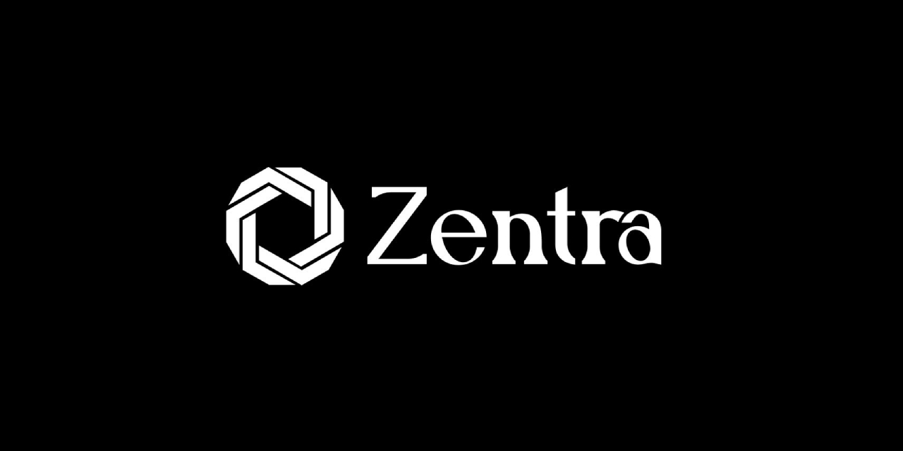

---
hide:
  - navigation
---

    <em>Zentra, your all in one Python SDK for building <a href="https://fastapi.tiangolo.com/">FastAPI</a> and <a href="https://nextjs.org/">Next.js</a> applications.</em>

---

 

    <a href="/" target="_blank" style="text-align: center;">
        <svg xmlns="http://www.w3.org/2000/svg" height="32" width="28" viewBox="0 0 448 512"><!--!Font Awesome Free 6.5.1 by @fontawesome - https://fontawesome.com License - https://fontawesome.com/license/free Copyright 2024 Fonticons, Inc.--><path fill="rgba(255, 255, 255, 0.7)" d="M96 0C43 0 0 43 0 96V416c0 53 43 96 96 96H384h32c17.7 0 32-14.3 32-32s-14.3-32-32-32V384c17.7 0 32-14.3 32-32V32c0-17.7-14.3-32-32-32H384 96zm0 384H352v64H96c-17.7 0-32-14.3-32-32s14.3-32 32-32zm32-240c0-8.8 7.2-16 16-16H336c8.8 0 16 7.2 16 16s-7.2 16-16 16H144c-8.8 0-16-7.2-16-16zm16 48H336c8.8 0 16 7.2 16 16s-7.2 16-16 16H144c-8.8 0-16-7.2-16-16s7.2-16 16-16z"/></svg>
        
Docs

    </a>
    <a href="https://github.com/Achronus/zentra/" target="_blank"  style="text-align: center;">
        <svg xmlns="http://www.w3.org/2000/svg" height="32" width="28" viewBox="0 0 640 512"><!--!Font Awesome Free 6.5.1 by @fontawesome - https://fontawesome.com License - https://fontawesome.com/license/free Copyright 2024 Fonticons, Inc.--><path fill="rgba(255, 255, 255, 0.7)" d="M392.8 1.2c-17-4.9-34.7 5-39.6 22l-128 448c-4.9 17 5 34.7 22 39.6s34.7-5 39.6-22l128-448c4.9-17-5-34.7-22-39.6zm80.6 120.1c-12.5 12.5-12.5 32.8 0 45.3L562.7 256l-89.4 89.4c-12.5 12.5-12.5 32.8 0 45.3s32.8 12.5 45.3 0l112-112c12.5-12.5 12.5-32.8 0-45.3l-112-112c-12.5-12.5-32.8-12.5-45.3 0zm-306.7 0c-12.5-12.5-32.8-12.5-45.3 0l-112 112c-12.5 12.5-12.5 32.8 0 45.3l112 112c12.5 12.5 32.8 12.5 45.3 0s12.5-32.8 0-45.3L77.3 256l89.4-89.4c12.5-12.5 12.5-32.8 0-45.3z"/></svg>
        
Code

    </a>
    <a href="https://pypi.org/project/zentra-sdk/" target="_blank"  style="text-align: center;">
        <svg xmlns="http://www.w3.org/2000/svg" height="32" width="28" viewBox="0 0 448 512"><!--!Font Awesome Free 6.6.0 by @fontawesome - https://fontawesome.com License - https://fontawesome.com/license/free Copyright 2024 Fonticons, Inc.--><path fill="rgba(255, 255, 255, 0.7)" d="M439.8 200.5c-7.7-30.9-22.3-54.2-53.4-54.2h-40.1v47.4c0 36.8-31.2 67.8-66.8 67.8H172.7c-29.2 0-53.4 25-53.4 54.3v101.8c0 29 25.2 46 53.4 54.3 33.8 9.9 66.3 11.7 106.8 0 26.9-7.8 53.4-23.5 53.4-54.3v-40.7H226.2v-13.6h160.2c31.1 0 42.6-21.7 53.4-54.2 11.2-33.5 10.7-65.7 0-108.6zM286.2 404c11.1 0 20.1 9.1 20.1 20.3 0 11.3-9 20.4-20.1 20.4-11 0-20.1-9.2-20.1-20.4 .1-11.3 9.1-20.3 20.1-20.3zM167.8 248.1h106.8c29.7 0 53.4-24.5 53.4-54.3V91.9c0-29-24.4-50.7-53.4-55.6-35.8-5.9-74.7-5.6-106.8 .1-45.2 8-53.4 24.7-53.4 55.6v40.7h106.9v13.6h-147c-31.1 0-58.3 18.7-66.8 54.2-9.8 40.7-10.2 66.1 0 108.6 7.6 31.6 25.7 54.2 56.8 54.2H101v-48.8c0-35.3 30.5-66.4 66.8-66.4zm-6.7-142.6c-11.1 0-20.1-9.1-20.1-20.3 .1-11.3 9-20.4 20.1-20.4 11 0 20.1 9.2 20.1 20.4s-9 20.3-20.1 20.3z"/></svg>
        
PyPi

    </a>

---

Every new software project brings a familiar set of repetitive tasks: configuring API routes, setting up authentication, and crafting frontend components from scratch. These repetitive steps not only drain your time but also divert your focus from building the unique features that set your application apart.

What if you have 10 projects to build, or 100, or 1000? Imagine having to set up everything from scratch every single time. The constant cycle of boilerplate coding can be frustrating and counterproductive, leaving you bogged down in setup rather than innovating.

Introducing __Zentra__ — an open-source, free to use, SDK for rapidly creating [FastAPI [:material-arrow-right-bottom:]](https://fastapi.tiangolo.com/) and [Next.js [:material-arrow-right-bottom:]](https://nextjs.org/) applications.

Packed with an intuitive suite of CLI commands, documentation, and development kit, this tool simplifies your development process, allowing you to effortlessly build applications in weeks, not months.

## Active Development

Zentra is a tool that is continuously being developed. There's a lot still to do to make it a fully functioning SDK, such as a working CLI, detailed API documentation, and components for various libraries.

Our goal is to provide a quality open-source product that works 'out-of-the-box' that everyone can experiment with, and then gradually fix unexpected bugs and introduce more component libraries on the road to a `v1.0.0` release.

## Support

We'll need help from developers like YOU :punch: to make this tool a delight to use, and a product worthy of the `Python`, `NextJS`, `React` and `Software/Web Development` community.

Feedback and criticism will always be welcomed, and is encouraged to help make this tool worthwhile.
