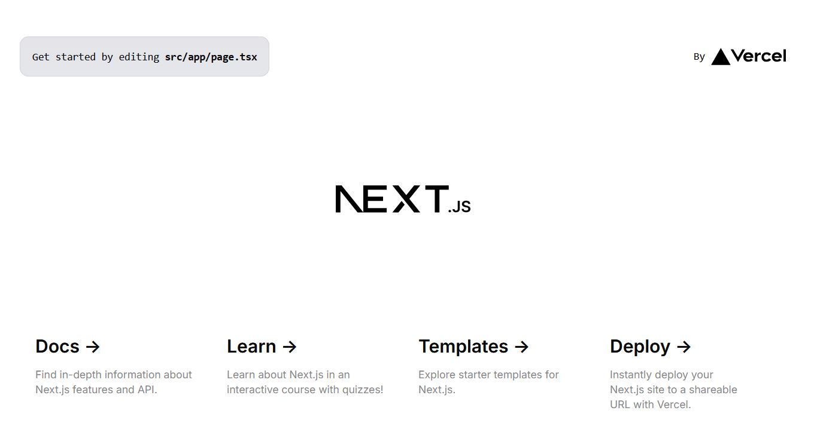

# Creating a Project

Using the SDK is the easiest method for getting started with a new project.

Simply run the [`init`](../commands/init.md) command and you'll have a [FastAPI [:material-arrow-right-bottom:]](https://fastapi.tiangolo.com/) backend and [Next.js [:material-arrow-right-bottom:]](https://nextjs.org/) frontend in seconds! No extra parameters needed.

```cmd title=""
zentra init
```

You'll find two new shiny directories in your project folder that will look similar to this:

```cmd title=""
<project_name>/
├── backend/
│   ├── app/
│   │   └── ...
│   ├── ...
│   ├── .env
│   ├── alembic.ini
│   ├── pyproject.toml
│   └── ...
├── frontend/
│   ├── public/
│   │   └── ...
│   ├── src/
│   │   └── ...
│   ├── .env.local
│   ├── package.json
│   ├── tailwind.config.js
│   └── ...
├── env/
│   └── ...
├── .gitignore
└── README.md
```

## Backend Directory

??? question "Did you know?"

    We built the backend using the [`zentra-api`](../../api/index.md) package! 
    ```cmd title=""
    zentra-api init backend
    ```

    Pretty cool right?! 🤓

The backend directory is home to our [FastAPI [:material-arrow-right-bottom:]](https://fastapi.tiangolo.com/) files and is fully managed by the [`zentra-api`](../../api/index.md) package.

You can read more about it in the API [First Steps](../../api/tutorial/first-steps.md) tutorial.

## Frontend Directory

The frontend directory contains our [Next.js [:material-arrow-right-bottom:]](https://nextjs.org/) files and is unique to the SDK package.

We'll read more about this in the next chapter, but for now, we should probably finish setting up the frontend!😅

## Starting The Frontend

1. Firstly, access the frontend directory:

    ```cmd title=""
    cd frontend
    ```

2. Next, install the Node packages:

    ```shell title=""
    npm install
    ```

3. Test it works by running the development environment:

    ```shell title=""
    npm run dev
    ```

4. Navigate to [http://localhost:3000](http://localhost:3000) and you should see the following:



If so, you are good to go! 🚀
